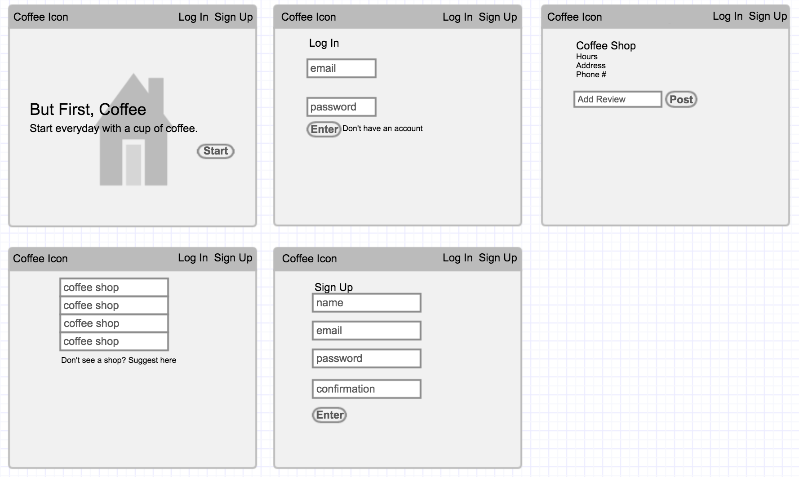
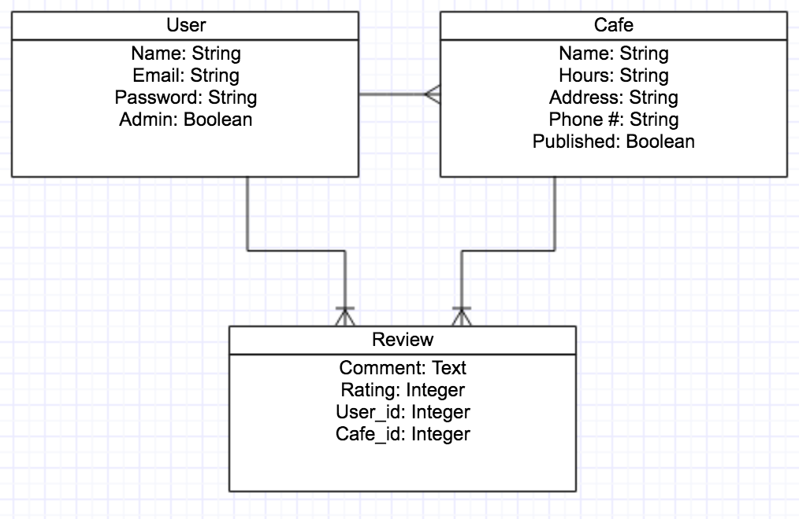

# But First, Coffee
A full-stack application created for users to find local coffee shops and add reviews.
## How It Works
Click "Sign Up" on the top right corner to create an account.

Once created, the user can now add reviews for the coffee shops and suggest new shops that are not listed. The user can also edit and delete reviews that they have posted.

Anyone, even guests, have access to view the list of coffee shops and their reviews. 

Click [Here](https://infinite-earth-17922.herokuapp.com/cafes) to view the app.

## Development and Technologies
- HTML
- CSS
- Ruby
- Bootstrap front-end library
- Ruby on Rails web application framework

## User Stories

Click [Here](https://trello.com/b/C6ivbAAa/app-project)

## Approach Taken
- Started off by creating a User model, one can create a user 
- Then a Cafe model, a user can create cafes
- Then a Review model, each review belongs to a user and a cafe
- Reviews can be edited and deleted by its user
- Created a sessions controller, so users can login and logout
- Anyone can view the page, but must be a user to make changes

## Wireframes and ERD

## Unsolved Problems and Future Work
- Rating system for cafes
- Better CSS
- Adjusts to mobile view
